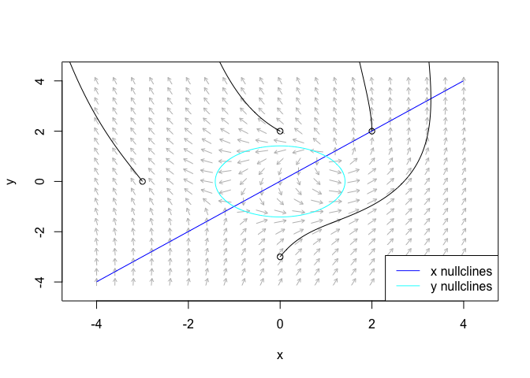

<!-- README.md is generated from README.Rmd. Please edit that file -->

# phaseR

*Phase plane analysis of one- and two-dimensional autonomous ODE
systems*

[](https://cran.r-project.org/package=phaseR)
[](https://cran.r-project.org/package=phaseR)
[](https://cran.r-project.org/package=phaseR)
[](https://doi.org/10.32614/RJ-2014-023)
[](https://github.com/mjg211/phaseR)
[](https://github.com/mjg211/phaseR)
[](https://github.com/mjg211/phaseR/commits/master)


## Description

**phaseR** provides functions to perform a qualitative analysis of one-
and two-dimensional autonomous ordinary differential equation (ODE)
systems, using phase plane methods. Programs are available to identify
and classify equilibrium points, plot the direction field, and plot
trajectories for multiple initial conditions. In the one-dimensional
case, a program is also available to plot the phase portrait. Whilst in
the two-dimensional case, programs are additionally available to plot
nullclines and stable/unstable manifolds of saddle points. Many example
systems are provided for the user.

## Getting started

You can install the released version of **phaseR** from
[CRAN](https://CRAN.R-project.org) with:

``` r
install.packages("phaseR")
```

Alternatively, the latest development version available on
[GitHub](https://github.com/) can be installed with:

``` r
devtools::install_github("mjg211/phaseR")
```

An introductory example of how to make use of the package’s core
functionality can be found below. More detailed support is available in
the package vignette, which can be accessed with `vignette("phaseR")`.
For further help, please contact Michael Grayling at
<michael.grayling@newcastle.ac.uk>.

## Example

As a basic example, we consider analysing the non-linear two-dimensional
system of ODEs provided in **phaseR** via `example12()`. By hand, we
typically first locate the nullclines and then identify the equilibrium
points. Following this, we produce a plot from which trajectories can be
sketched. This can all be seamlessly carried out in **phaseR** with:

``` r
example12_flowField  <- flowField(example12,
                                  xlim = c(-4, 4),
                                  ylim = c(-4, 4),
                                  add  = FALSE)
example12_nullclines <- nullclines(example12,
                                   xlim   = c(-4, 4), 
                                   ylim   = c(-4, 4),
                                   points = 500)
y0                   <- matrix(c( 2,  2,
                                 -3,  0,
                                  0,  2,
                                  0, -3), 
                               nrow  = 4,
                               ncol  = 2,
                               byrow = TRUE)
example12_trajectory <- trajectory(example12,
                                   y0   = y0,
                                   tlim = c(0, 10))
#> Note: col has been reset as required
```

 It
appears that both of the equilibria are unstable. We could verify this
by hand, but we can also perform this analysis in **phaseR** using
`stability()`:

``` r
example12_stability_1 <- stability(example12,
                                   ystar = c(1, 1))
#> tr = 3, Delta = 4, discriminant = -7, classification = Unstable focus
example12_stability_2 <- stability(example12,
                                   ystar = c(-1, -1),
                                   h     = 1e-8)
#> tr = -1, Delta = -4, discriminant = 17, classification = Saddle
```

## References

Grayling MJ (2014) [phaseR: An R Package for Phase Plane Analysis of
Autonomous ODE Systems](https://doi.org/10.32614/RJ-2014-023). *The R
Journal* 6(2):43-51. DOI: 10.32614/RJ-2014-023.
